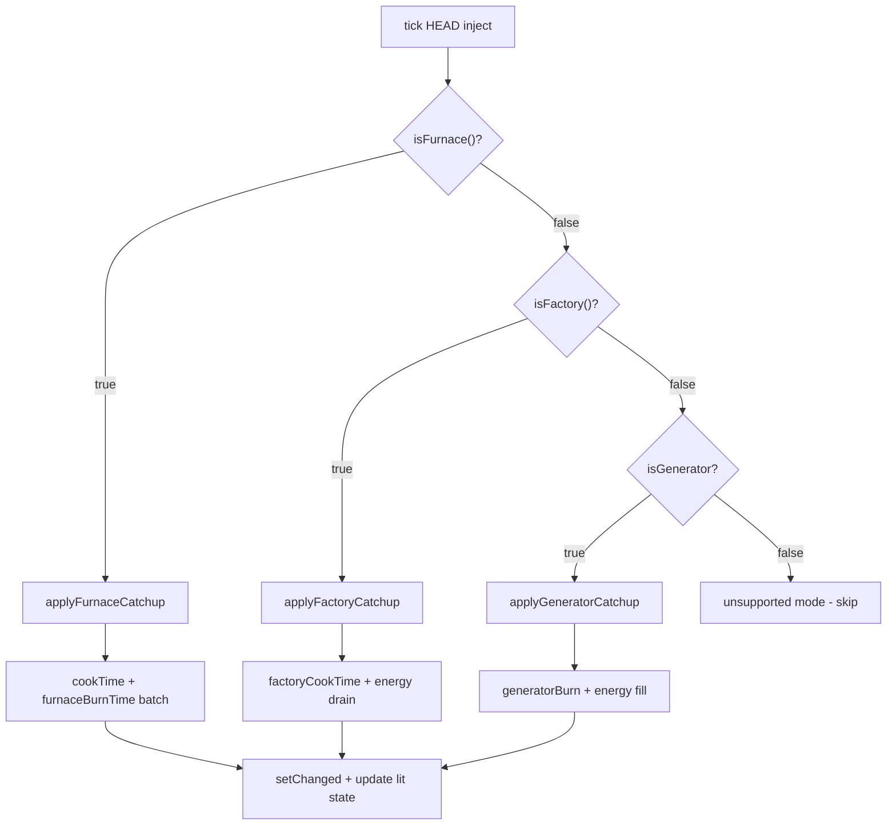

# План: KeepSmelting — поддержка Iron Furnaces

## 1. Анализ совместимости

### Структура Iron Furnaces (декомпилировано)

```
BlockIronFurnaceBase extends Block implements EntityBlock
  └─ BlockIronFurnaceTileBase extends TileEntityInventory extends BlockEntity
       └─ static tick(Level, BlockPos, BlockState, BlockIronFurnaceTileBase)
```

### Почему текущий KeepSmelting не работает

- Миксин [`FurnaceTickMixin`](../src/main/java/com/example/examplemod/mixin/FurnaceTickMixin.java:41) нацелен на `AbstractFurnaceBlockEntity`
- Iron Furnaces НЕ наследует `AbstractFurnaceBlockEntity` — свой кастомный `BlockIronFurnaceTileBase extends BlockEntity`
- У них свой статический тикер: `tick(Level, BlockPos, BlockState, BlockIronFurnaceTileBase)`

### 3 режима работы

Режим определяется по [`currentAugment[2]`](decompiled/ironfurnaces/ironfurnaces/tileentity/furnaces/BlockIronFurnaceTileBase.java:1892-1902) (синий аугмент-слот, слот 5):

| currentAugment[2] | Режим | Метод | Catchup? |
|---|---|---|---|
| 0 | 🔥 Furnace | `isFurnace()` | ✅ ДА |
| 1 | 🏭 Factory | `isFactory()` | ✅ ДА (ограничен RF) |
| 2 | ⚡ Generator | `isGenerator()` | ✅ ДА (ограничен топливом + RF-ёмкостью) |

---

## 2. Детали 3 режимов

### 2.1 Furnace (строки 942-1061)

| Поле | Тип | Назначение |
|------|-----|-----------|
| `furnaceBurnTime` | int | Остаток топлива в тиках |
| `cookTime` | int | Текущий прогресс плавки |
| `totalCookTime` | int | Тиков нужно на 1 предмет |
| `recipeType` | RecipeType | SMELTING/SMOKING/BLASTING |

**Логика тика:**
```
если furnaceBurnTime > 0: cookTime++
если cookTime >= totalCookTime → smelt(recipe), autoIO()
если furnaceBurnTime <= 0 И есть топливо:
  furnaceBurnTime = getBurnTime(fuel, recipeType) * getCookTime() / 200
  fuel.shrink(1), обработать остаточный предмет
```

**Catchup:** batch-эмуляция — вычислить сколько предметов можно переплавить за elapsedTicks с учётом топлива.

### 2.2 Factory (строки 781-867)

| Поле | Тип | Назначение |
|------|-----|-----------|
| `factoryCookTime[6]` | int[] | Прогресс каждого из 6 слотов |
| `factoryTotalCookTime[6]` | int[] | Нужное время на предмет для каждого слота |
| `usedRF[6]` | double[] | Потраченная RF на текущий предмет |
| `energy` | FEnergyStorage | Внутренний RF-буфер |

**Логика тика (на слот i):**
```
если factoryCookTime[i] > 0:
  factoryCookTime[i]++
  usedRF[i] += recipeRF / totalCookTime[i]
  energy -= recipeRF / totalCookTime[i]
  если cookTime[i] >= totalCookTime[i]:
    factorySmelt(recipe, slot)
    cookTime[i] = 0
```

**Ограничение:** Если `energy < recipeRF И cookTime[i] <= 0` — слот не запускается (строка 811).

**Catchup:** Эмулировать тики, пока хватает RF в буфере. Если RF кончился — остановиться.

### 2.3 Generator (строки 868-941)

| Поле | Тип | Назначение |
|------|-----|-----------|
| `generatorBurn` | double | Сколько RF\*20 осталось от текущего куска топлива |
| `generatorRecentRecipeRF` | int | Исходное значение generatorBurn (для расчётов) |
| `gottenRF` | double | RF уже получено за текущий кусок топлива |
| `getGeneration()` | int | RF за 1 тик (зависит от типа печи) |
| `getCapacity()` | int | Максимальный RF-буфер |

**Логика тика:**
```
если energy < capacity:
  если generatorBurn <= 0 И в слоте 6 есть топливо:
    сжечь 1 единицу топлива
    generatorBurn = getGeneratorBurn()
    generatorRecentRecipeRF = generatorBurn
  если generatorBurn > 0:
    energy += getGeneration()
    generatorBurn -= getGeneration() / 20.0
  energyOut()  // раздать RF соседям
```

**Ограничения:**
- Топливо сжигается **1 раз** за кусок (строка 885: `itemstack.shrink(1)`)
- `generatorBurn` конечен — когда истечёт, нужен новый кусок
- `energy >= capacity` — буфер заполнен, генерация прекращается (строка 878)

**Catchup:** Эмулировать тики, сжигая топливо из слота 6 по одному куску, пока не кончится топливо или не заполнится буфер.

---

## 3. Архитектура нового миксина



### Почему generator/factory — не читерство

| Режим | Лимит | Что кончается |
|-------|-------|--------------|
| Furnace | `furnaceBurnTime` + `input.stack.count` | Топливо + руда |
| Factory | `energy` в буфере | RF (офлайн не пополняется) |
| Generator | `fuel.stack.count` + `getCapacity()` | Топливо + место под RF |

Ни один не даёт бесконечного ресурса — это **ускоренная симуляция**, а не генерация из воздуха.

---

## 4. Новые файлы

### 4.1 `IronFurnaceTickMixin.java`

```java
// Путь: src/main/java/com/example/examplemod/mixin/ironfurnaces/IronFurnaceTickMixin.java
//
// Миксин в тикер Iron Furnaces для offline catchup.
// Безопасно пропускается если Iron Furnaces не установлен (defaultRequire: 0).
// Обрабатывает все 3 режима: furnace, factory, generator.

@Mixin(targets = "ironfurnaces/tileentity/furnaces/BlockIronFurnaceTileBase")
public abstract class IronFurnaceTickMixin {

    @Unique
    private static final String TAG_LAST_TIME = "keepsmelting_lastRealTime";
    @Unique
    private static final String TAG_VERSION = "keepsmelting_version";
    @Unique
    private static final int NBT_VERSION = 1;

    @Unique
    private long keepsmelting$lastRealTime;

    // ── NBT save/load ──

    @Inject(method = "saveAdditional", at = @At("TAIL"))
    private void onSave(CompoundTag tag, CallbackInfo ci) {
        tag.putInt(TAG_VERSION, NBT_VERSION);
        tag.putLong(TAG_LAST_TIME, this.keepsmelting$lastRealTime);
    }

    @Inject(method = "load", at = @At("TAIL"))
    private void onLoad(CompoundTag tag, CallbackInfo ci) {
        this.keepsmelting$lastRealTime = tag.getLong(TAG_LAST_TIME);
    }

    // ── Main tick intercept ──

    @Inject(method = "tick", at = @At("HEAD"))
    private static void onTick(Level level, BlockPos pos, BlockState state,
                               BlockIronFurnaceTileBase tile, CallbackInfo ci) {
        if (level.isClientSide) return;
        if (!KeepSmeltingConfig.COMMON.catchupEnabled.get()) return;

        IronFurnaceTickMixin self = (IronFurnaceTickMixin)(Object) tile;
        long now = System.currentTimeMillis();
        long last = self.keepsmelting$lastRealTime;
        self.keepsmelting$lastRealTime = now;
        if (last == 0) return;

        long elapsed = (now - last) / 50L;
        int minDelta = KeepSmeltingConfig.COMMON.minDeltaThreshold.get();
        if (elapsed < minDelta) return;
        long max = KeepSmeltingConfig.COMMON.maxCatchupTicks.get();
        elapsed = Math.min(elapsed, max);
        if (elapsed <= 0) return;

        if (tile.isFurnace()) {
            applyFurnaceCatchup(tile, elapsed, level, pos);
        } else if (tile.isFactory()) {
            applyFactoryCatchup(tile, elapsed, level, pos);
        } else if (tile.isGenerator()) {
            applyGeneratorCatchup(tile, elapsed, level, pos);
        }
    }
    
    // ── Furnace ──

    @Unique
    private static void applyFurnaceCatchup(...) { /* batch cookTime + furnaceBurnTime */ }

    // ── Factory ──

    @Unique
    private static void applyFactoryCatchup(...) { /* эмуляция 6 слотов, трата RF */ }

    // ── Generator ──

    @Unique
    private static void applyGeneratorCatchup(...) { /* сжигание топлива, заполнение RF */ }
}
```

### 4.2 `keepsmelting.mixins.json`

```json
{
  "required": true,
  "minVersion": "0.8.5",
  "package": "com.example.examplemod.mixin",
  "compatibilityLevel": "JAVA_17",
  "refmap": "keepsmelting.refmap.json",
  "mixins": [
    "IFurnaceAccessor",
    "FurnaceTickMixin",
    "ironfurnaces.IronFurnaceTickMixin"
  ],
  "injectors": {
    "defaultRequire": 0
  }
}
```

### 4.3 `build.gradle`

```gradle
repositories {
    flatDir {
        dirs 'ironfurnaces-1.20.1-4.1.8'
    }
}

dependencies {
    compileOnly name: "ironfurnaces-1.20.1-4.1.8"
}
```

`compileOnly` — классы видны при компиляции, но не добавляются в manifest мода.

---

## 5. Дорожная карта реализации

| Этап | Файл | Что делаем |
|------|------|-----------|
| 1 | `IronFurnaceTickMixin.java` | NBT save/load + inject в tick + диспетчеризация по режиму |
| 2 | `IronFurnaceTickMixin.java` | `applyFurnaceCatchup()` — batch cookTime |
| 3 | `IronFurnaceTickMixin.java` | `applyGeneratorCatchup()` — сжигание топлива + RF |
| 4 | `IronFurnaceTickMixin.java` | `applyFactoryCatchup()` — 6 слотов + RF drain |
| 5 | `keepsmelting.mixins.json` | Добавить запись миксина |
| 6 | `build.gradle` | `compileOnly` зависимость |

---

## 6. Риски

| Риск | Митигация |
|------|-----------|
| `smelt()` package-private (default access) | Использовать рефлексию или дублировать логику через поля |
| `BlockIronFurnaceTileBase` obfuscated name | `@Mixin(targets = "...")` со строковым путём |
| `compileOnly` не видит jar из поддиректории | `flatDir` репозиторий + `name` без расширения |

