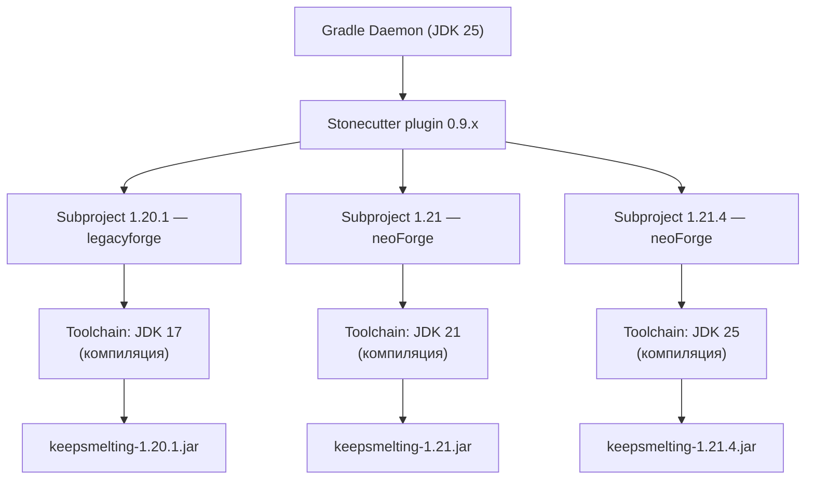

# Multi-Version JDK Strategy (v2)

> **Важнейшее открытие:** Stonecutter 0.9.x **сам требует JDK 25** для работы.
> Это полностью меняет стратегию — Gradle должен работать на JDK 25.
> Хорошая новость: Forge 1.20.1 и legacyforge плагин 2.0.141 **поддерживают JDK 25**.

## 1. Проблема (обновлённая)

| Компонент | Требуемый JDK | Причина |
|---|---|---|
| **Stonecutter 0.9.x** (Gradle plugin) | **JDK 25** | Требует Kotlin 2.4.0+ и Gradle 9.1+ |
| **Minecraft 1.20.1** (Forge) | **JDK 17** | Старый формат байткода, legacy MCP mappings |
| **Minecraft 1.20.5–1.21.1** | **JDK 21** | Mojang перешли на JDK 21 |
| **Minecraft 1.21.2+** | **JDK 25** | Mojang перешли на JDK 25 |

**Старая (неверная) стратегия:** запускать Gradle на JDK 21, toolchains для остальных.
**Почему не работает:** Stonecutter 0.9.x **требует JDK 25** — Gradle 9.1+ на JDK 21 просто не запустит плагин.

---

## 2. Реальность: JDK 25 как единая точка входа



**Ключевой принцип:** Gradle Daemon работает на **JDK 25**. Toolchains управляют тем, на каком JDK **компилируется** код для каждой MC-версии.

### Почему это работает

1. **Stonecutter 0.9.6** — Gradle plugin, выполняется в процессе Gradle на JDK 25 ✅
2. **legacyforge 2.0.141** — Gradle plugin, выполняется в процессе Gradle на JDK 25 ✅ (совместим)
3. **Forge 1.20.1** — сам Minecraft может работать на JDK 17/21/25 ✅ (Forge 47.4.10+ поддерживает JDK 25)
4. **Toolchain JDK 17** — компилирует байткод для 1.20.1 в Java 17 class format
5. **Toolchain JDK 21** — компилирует байткод для 1.21 в Java 21 class format

---

## 3. Требования

| Компонент | Минимальная версия |
|---|---|
| JDK | **JDK 25** (для Gradle и Stonecutter) |
| Gradle | **9.1+** (требуется для JDK 25 и Stonecutter) |
| Stonecutter | **0.9.6** |
| legacyforge plugin | **2.0.141** (последняя, JDK 25 compatible) |
| fooijay-resolver | **0.9.0** (скачивает JDK 17/21/25 при необходимости) |

### Проверка установки

```powershell
# Проверить версию JDK
java -version
# Ожидаемый вывод: openjdk version "25" ...

# Проверить, какие JDK видит Gradle
./gradlew -q javaToolchains
```

---

## 4. Архитектура проекта

### 4.1 Структура

```
keepsmelting/
├── settings.gradle                    ← Stonecutter + fooijay
├── build.gradle                       ← общий код
├── gradle.properties                  ← версии
│
├── versions/
│   ├── 1.20.1/                        ← subproject для MC 1.20.1
│   │   ├── build.gradle               ← legacyforge, toolchain JDK 17
│   │   └── src/...                    ← код + миксины
│   ├── 1.21/                          ← subproject для MC 1.21
│   │   ├── build.gradle               ← neoForge/Fabric, toolchain JDK 21
│   │   └── src/...                    ← код + миксины
│   └── 1.21.4/                        ← subproject для MC 1.21.4
│       ├── build.gradle               ← neoForge/Fabric, toolchain JDK 25
│       └── src/...                    ← код + миксины
│
├── common/                            ← общий код (препроцессор Stonecutter)
│   └── src/main/java/...
│
└── stonecutter.gradle                 ← конфиг Stonecutter
```

### 4.2 `settings.gradle`

```gradle
plugins {
    id 'org.gradle.toolchains.foojay-resolver-convention' version '0.9.0'
    id 'stonecutter' version '0.9.6'
}

stonecutter {
    // Каждая версия — отдельный subproject
    create(rootProject) {
        versions("1.20.1", "1.21", "1.21.4")
    }
}

rootProject.name = 'keepsmelting'
```

### 4.3 `versions/1.20.1/build.gradle`

```gradle
plugins {
    id 'java'
    id 'net.neoforged.moddev.legacyforge' version '2.0.141'
}

java {
    // Компилируем в Java 17 class format — для совместимости с Minecraft 1.20.1
    toolchain.languageVersion = JavaLanguageVersion.of(17)
}

legacyForge {
    version = "1.20.1-47.4.10"
    // ... стандартные настройки
}

dependencies {
    implementation project(':common')
    compileOnly files('libs/ironfurnaces-1.20.1-4.1.8.jar')
}

mixin {
    add sourceSets.main, "keepsmelting.refmap.json"
    config "keepsmelting.mixins.json"
}
```

### 4.4 `versions/1.21/build.gradle`

```gradle
plugins {
    id 'java'
    id 'net.neoforged.moddev' version '2.0.141'
}

java {
    // Компилируем в Java 21 class format — для Minecraft 1.21
    toolchain.languageVersion = JavaLanguageVersion.of(21)
}

neoForge {
    version = "21.0.0"
    // ... стандартные настройки
}

dependencies {
    implementation project(':common')
}
```

### 4.5 `versions/1.21.4/build.gradle`

```gradle
plugins {
    id 'java'
    id 'net.neoforged.moddev' version '2.0.141'
}

java {
    // Компилируем в Java 25 class format — для Minecraft 1.21.4+
    toolchain.languageVersion = JavaLanguageVersion.of(25)
}

neoForge {
    version = "21.4.0"
    // ... стандартные настройки
}

dependencies {
    implementation project(':common')
}
```

---

## 5. Как это работает под капотом

### Конфигурация (Configuration phase)

```
settings.gradle → fooijay-resolver активирован
                → Stonecutter создаёт 3 subproject: 1.20.1, 1.21, 1.21.4
                
Каждый subproject:
→ java.toolchain.languageVersion = X
→ Gradle проверяет, есть ли JDK X в системе
→ Если нет — fooijay скачивает JDK X в ~/.gradle/jdks/
→ Gradle-плагины (legacyforge, neoForge) выполняются на JDK 25
```

### Компиляция (Execution phase)

```
./gradlew :1.20.1:build

→ Gradle (JDK 25) запускает legacyforge плагин
→ legacyforge плагин конфигурирует Minecraft 1.20.1
→ JavaCompile задача использует toolchain JDK 17
→ Компиляция в Java 17 class format
→ Сборка keepsmelting-1.20.1.jar
```

### Переключение активной версии в IDE

```bash
# Stonecutter переключает, какой код активен
./gradlew :stonecutter:setActiveTo_1_20_1
# или
./gradlew :stonecutter:setActiveTo_1_21
```

Stonecutter меняет **какой исходный код видит IDE**, но Gradle задачи работают для **всех** subproject независимо.

---

## 6. Альтернативы Stonecutter (если JDK 25 — проблема)

### 6.1 Отдельные Gradle проекты с общим кодом

Если Stonecutter + JDK 25 вызывают проблемы с плагинами:

```
keepsmelting/
├── mc-1.20.1/                        ← Gradle 8.10, JDK 17 (через JAVA_HOME)
│   ├── build.gradle                  ← legacyforge 2.0.91
│   ├── settings.gradle
│   ├── gradlew
│   └── src/main/java/
│       └── com/keepsmelting/
│           ├── … (весь код + миксины)
│           └── common/                ← hard link или copy
├── mc-1.21/                          ← Gradle 8.10, JDK 21
│   └── … (аналогично)
├── common/                           ← истинный источник общего кода
│   └── src/main/java/
│       └── com/keepsmelting/
│           ├── api/
│           └── internal/
└── build-all.ps1                     ← CI скрипт
```

**build-all.ps1 — синхронизация общего кода:**
```powershell
$common = "common/src/main/java/com/keepsmelting"
$versions = @("mc-1.20.1", "mc-1.21", "mc-1.21.4")

foreach ($v in $versions) {
    $target = "$v/src/main/java/com/keepsmelting/common"
    if (-not (Test-Path $target)) {
        New-Item -ItemType SymbolicLink -Path $target -Target "../$common"
    }
}
```

### 6.2 MultiLoader шаблон (Only Forge 1.20.1)

Текущая архитектура (без multi-version) — simplest path:
- Один проект на JDK 17 с toolchain
- Когда понадобится 1.21+ — форкнуть репозиторий или сделать отдельную ветку

---

## 7. Сравнение подходов

| Фактор | Stonecutter + JDK 25 | Отдельные проекты | MultiLoader (1 версия) |
|---|---|---|---|
| Поддержка MC 1.12.2 | ❌ Слишком старый Forge | ✅ Можно | ❌ |
| Поддержка MC 1.20.1 | ✅ Toolchain JDK 17 | ✅ Отдельный проект | ✅ Текущий |
| Поддержка MC 1.21 | ✅ Toolchain JDK 21 | ✅ Отдельный проект | ❌ |
| Поддержка MC 1.21.4+ | ✅ Toolchain JDK 25 | ✅ Отдельный проект | ❌ |
| Общий код | ✅ Препроцессор `//?` | ⚠️ Симлинк | ✅ Единый src |
| CI/CD | Одна сборка | N сборок | 1 сборка |
| Сложность | Высокая (JDK 25 req) | Средняя | Низкая |

---

## 8. Пошаговый план для KeepSmelting

### Фаза 1: Подготовка (сейчас — только 1.20.1)

```powershell
# 1. Установить JDK 25
# Скачать с https://adoptium.net/

# 2. Обновить Gradle wrapper до 9.1+
gradle wrapper --gradle-version 9.1.0

# 3. Обновить legacyforge до 2.0.141
#    В build.gradle:
#    id 'net.neoforged.moddev.legacyforge' version '2.0.141'

# 4. Добавить toolchain JDK 17
#    java.toolchain.languageVersion = JavaLanguageVersion.of(17)

# 5. Добавить fooijay в settings.gradle
#    id 'org.gradle.toolchains.foojay-resolver-convention' version '0.9.0'

# 6. Проверить сборку
./gradlew build    # ← Gradle на JDK 25, компиляция на JDK 17
```

### Фаза 2: Multi-version (когда понадобится)

1. Добавить Stonecutter plugin 0.9.6
2. Реструктурировать в `versions/` subproject
3. Перенести общий код в `common/`
4. Добавить препроцессорные комментарии `//?`
5. Добавить subproject для 1.21, 1.21.4

---

## 9. Риски и митигации

| Риск | Митигация |
|---|---|
| **legacyforge 2.0.141 несовместим с JDK 25** | Использовать `org.gradle.java.home` в `gradle.properties` для JDK 21 для конфигурации, toolchain для компиляции. Или остаться на отдельном проекте для 1.20.1. |
| **Stonecutter требует Gradle 9.1+, но legacyforge не протестирован** | Проверить сборку на JDK 25. Если падает — использовать отдельные проекты. |
| **Mixin AP processor требует JDK 17** | Toolchain должен быть JDK 17. Gradle-plugin выполняется на JDK 25, но annotation processor работает через toolchain. |
| **Iron Furnaces jar несовместим с JDK 25** | `compileOnly` — jar не выполняется, только компилируется. Если классы в jar старые — JDK 17 toolchain справится. |
| **Пользователи не смогут запустить мод на JDK 25** | Мод компилируется **в Java 17 class format** (через toolchain). Пользователь может запускать на любом JDK ≥ 17. |

---

## 10. Итог: что изменилось

```
ДО (неправильно):                ПОСЛЕ (правильно):
Gradle на JDK 21                 Gradle на JDK 25
  └─ toolchain 17 для 1.20.1       └─ Stonecutter 0.9.x работает ✅
  └─ toolchain 21 для 1.21         └─ toolchain 17 для 1.20.1
  └─ ❌ toolchain 25 требует       └─ toolchain 21 для 1.21
      Gradle 9.1+, Stonecutter      └─ toolchain 25 для 1.21.4
      не работает на JDK 21         └─ всё компилируется корректно
```

**Ключевое правило:** Gradle на JDK 25, Stonecutter доволен, toolchains компилируют под любую MC-версию.

---

## 11. Ссылки

- [Stonecutter Documentation](https://stonecutter.kikugie.dev/)
- [Gradle Toolchains](https://docs.gradle.org/current/userguide/toolchains.html)
- [ModDevGradle Legacy Plugin — JDK 25 support](https://github.com/neoforged/ModDevGradle/blob/main/LEGACY.md)
- [PSA: Forge 1.20.1 supports Java 25](https://www.reddit.com/r/feedthebeast/comments/1nlvq8c/psa_forge_1201_now_supports_java_25)
- [foojay-resolver-convention](https://github.com/gradle/foojay-toolchains)
