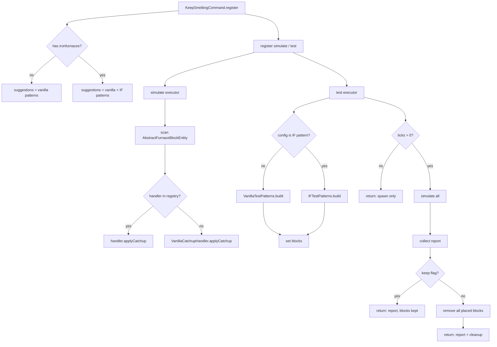

# План: Унифицированные тестовые команды

## Текущее состояние

```
KeepSmeltingCommand          ← только настройки, без тестов
  ├─ catchup/debug/time/maxTicks/minDelta/status
  └─ help

IronFurnaceCommands          ← simulate / spawn / test только для IF
  (загружается только с ironfurnaces)
```

## Проблема

Команды `simulate`, `spawn`, `test` существуют **только для Iron Furnaces** и недоступны без IF. Ванильные печи тоже имеют catchup, но нет способа протестировать его через команды.

## Цель

Сделать `simulate` и `test` **универсальными** — работают для любых печей. `test` остаётся одной командой с опциональной очисткой. Ванильные паттерны доступны всегда, IF-паттерны — только при наличии IF.

---

## 1. Архитектура

### 1.1. `VanillaTestPatterns` — новый класс (всегда, без IF-зависимостей)

Хранит тестовые схемы для ванильных печей. Не имеет прямых ссылок на IF.

```java
public class VanillaTestPatterns {
    static final Map<String, String> PATTERNS = Map.of(
        "furnace",       "Furnace solo | coal+raw_iron",
        "furnace+chest", "Furnace | barrel:coal→furnace, barrel:out←furnace",
        "smoker",        "Smoker solo | coal+beef",
        "blast",         "Blast furnace solo | coal+raw_iron"
    );

    static List<FurnacePlacement> build(String config, BlockPos origin, boolean hasChests) {
        // строительство схемы из ванильных блоков
    }
}
```

### 1.2. `IFTestPatterns` — переименовать `IronFurnaceCommands`

Хранит IF-схемы. Только схемы и спавн — без регистрации команд. Содержит прямые ссылки на IF.

```java
public class IFTestPatterns {
    static final Map<String, String> PATTERNS = Map.of(
        "basic",   "Gen→Fact RF",
        "gen",     "Generator solo",
        "factory", "Factory solo",
        "nw",      "Gen→Gen→Fact network"
    );

    static List<IFPatternPlacement> build(String config, BlockPos origin, boolean hasChests) {
        // строительство IF-схемы, прямое использование BlockIronFurnaceTileBase
    }
}
```

### 1.3. `KeepSmeltingCommand` — централизованная регистрация

```java
public static void register(CommandDispatcher<CommandSourceStack> dispatcher) {
    var cmd = Commands.literal("keepsmelting")
        .requires(src -> src.hasPermission(2));

    // settings — всегда
    cmd.then(... catchup/debug/time/maxTicks/minDelta ...);
    cmd.then(Commands.literal("status").executes(...));

    // simulate — всегда, универсальный
    cmd.then(Commands.literal("simulate")
        .then(Commands.argument("ticks", longArg())
            .executes(ctx -> runSimulate(ctx, ticks))));

    // test — всегда, универсальный
    // test <config>              → spawn only
    // test <config> <ticks>      → spawn + simulate + report + cleanup
    // test <config> <ticks> keep → spawn + simulate + report, keep blocks
    cmd.then(Commands.literal("test")
        .then(Commands.argument("config", word())
            .suggests(configSuggestionProvider(allPatterns))
            .executes(ctx -> runTestSpawn(ctx, config))
            .then(Commands.argument("ticks", longArg())
                .executes(ctx -> runTest(ctx, config, ticks, true))
                .then(Commands.literal("keep")
                    .executes(ctx -> runTest(ctx, config, ticks, false))
                ))));

    dispatcher.register(cmd);
}
```

---

## 2. Детали реализации

### 2.1. `simulate` — универсальный поиск печей

```java
BlockEntity be = level.getBlockEntity(p);
if (be instanceof AbstractFurnaceBlockEntity) {
    IFurnaceCatchupHandler h = CatchupHandlerRegistry.find(be.getClass());
    if (h != null) {
        h.applyCatchup(be, ticks, level, p);
    } else {
        VanillaCatchupHandler.INSTANCE.applyCatchup(be, ticks, level, p);
    }
    found++;
}
```

### 2.2. `test` — три режима

| Синтаксис | Действие | Очистка |
|-----------|----------|---------|
| `test <config>` | Только спавн | Нет, печи остаются |
| `test <config> <ticks>` | Спавн → симуляция → отчёт | Да, удаляет |
| `test <config> <ticks> keep` | Спавн → симуляция → отчёт | Нет, печи остаются |

### 2.3. Объединённые suggestions

При регистрации `KeepSmeltingCommand` собирает все паттерны:

```java
Set<String> allPatterns = new LinkedHashSet<>(VanillaTestPatterns.PATTERNS.keySet());
if (ModList.get().isLoaded("ironfurnaces")) {
    allPatterns.addAll(IFTestPatterns.PATTERNS.keySet());
}
```

### 2.4. Удаление `IronFurnacesCommands`

Класс удаляется. Его место занимают:
- `VanillaTestPatterns` — всегда, без IF-зависимостей
- `IFTestPatterns` — только с IF, содержит прямые IF-ссылки

---

## 3. Схема потока



---

## 4. Изменяемые файлы

| Файл | Действие | Описание |
|------|----------|----------|
| `command/KeepSmeltingCommand.java` | Изменить | Добавить simulate + test, merged suggestions |
| `command/IronFurnaceCommands.java` | Удалить | Заменить на IFTestPatterns |
| `command/IFTestPatterns.java` | Создать | Паттерны и спавн для IF (без команд) |
| `command/VanillaTestPatterns.java` | Создать | Паттерны и спавн для ванильных печей |
| `KeepSmelting.java` | Изменить | Убрать IronFurnaceCommands.register |

---

## 5. Зависимости

- `VanillaTestPatterns` — только `minecraft` блоки
- `IFTestPatterns` — `compileOnly files('libs/ironfurnaces-...')`
- `KeepSmeltingCommand` — использует `VanillaCatchupHandler.INSTANCE` как fallback

---

## 6. Финальная структура команд

```
/keepsmelting catchup <true|false>
/keepsmelting debug <OFF|CHAT|LOG>
/keepsmelting time <REALTIME|GAMETIME>
/keepsmelting maxTicks <value>
/keepsmelting minDelta <value>
/keepsmelting status
/keepsmelting simulate <ticks>
/keepsmelting test <config> [ticks] [keep]
```

---

## 7. Примеры использования

**Без IF:**
- `test furnace` — спавн ванильной печи с углём и рудой
- `test furnace+chest 1000` — спавн + симуляция 1000t + отчёт + удаление
- `test smoker 500 keep` — спавн + симуляция 500t + отчёт, печь остаётся
- `simulate 1000` — догоняет все печи вокруг

**С IF:**
- Всё выше + `test basic` — спавн Gen→Fact схемы
- `test nw 5000 keep` — сеть Gen→Gen→Fact, симуляция, отчёт, печи остаются
