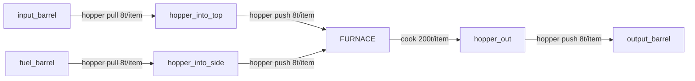
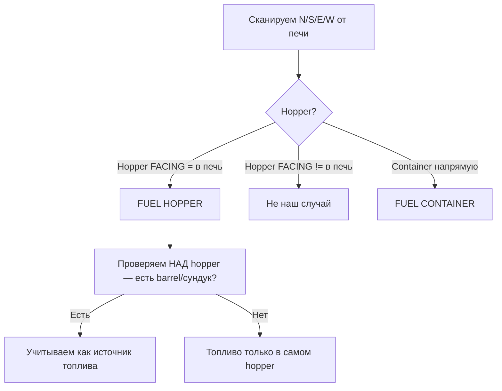
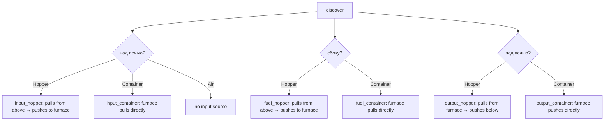
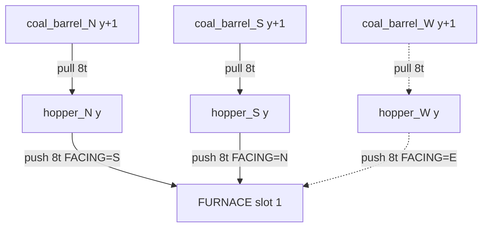

# План: Симуляция конвейера с воронками для ванильных печей

## Текущая проблема

[`VanillaCatchupHandler`](src/main/java/com/keepsmelting/internal/catchup/VanillaCatchupHandler.java) просто складывает все ресурсы (печь + воронки + бочки) и считает, сколько предметов можно переплавить за `elapsed` тиков. Он **игнорирует**:

- Скорость воронок (8 тиков на операцию pull/push)
- Куда смотрит воронка (может ли она положить предмет)
- Цепочку: бочка → воронка → печь → воронка → бочка
- Пропускную способность каждого узла

## Цель

Создать `HopperPipelineSimulator` — симулятор, который учитывает реальные ограничения:



---

## 1. Что нужно учитывать

### 1.1. Воронки

| Свойство | Значение |
|----------|----------|
| Pull cooldown | 8 тиков (тянет из контейнера НАД собой) |
| Push cooldown | 8 тиков (кладет в контейнер в направлении FACING) |
| Скорость | 1 предмет за 8 тиков = 0.125 предметов/тик |
| Слотов | 5 |

Важно: воронка может **одновременно** пушить и пуллить, но каждый по 8 тиков. За 8 тиков она может: взять 1 предмет сверху И положить 1 предмет вниз.

### 1.2. Печь

| Свойство | Furnace | Smoker | Blast Furnace |
|----------|---------|--------|---------------|
| Время плавки | 200 тиков | 100 тиков | 200 тиков |
| Скорость | 0.005 предм/тик | 0.01 предм/тик | 0.005 предм/тик |
| Топливо уголь | 1600 тиков | 1600 тиков | 1600 тиков |
| Вход | 1 слот (0) | 1 слот (0) | 1 слот (0) |
| Выход | 1 слот (1) | 1 слот (1) | 1 слот (1) |

### 1.3. Узкие места (bottlenecks)

Для теста `furnace+chest`:
- Вход: hopper тянет из бочки → 8t/item → максимум 1/8 = 0.125 предм/тик
- Плавка: 200t/item → максимум 1/200 = 0.005 предм/тик
- Выход: hopper выталкивает → 8t/item → максимум 0.125 предм/тик

**Bottleneck = печь (200 тиков)**, воронки в 25 раз быстрее. Поэтому для furnace+chest упрощение ("складываем всё") даёт почти правильный результат.

Но для smoker (100 тиков) разница меньше, а для печей с аугментами скорости/топлива — может быть критичной.

---

## 2. Архитектура

### 2.1. Модель данных

```java
class PipelineNode {
    enum Type { SOURCE_BARREL, INPUT_HOPPER, FUEL_HOPPER, FURNACE, OUTPUT_HOPPER, DEST_BARREL }
    Type type;
    int itemCount;        // сколько предметов
    int maxStack;         // макс в слоте
    /**
     * Пропускная способность:
     * - HOPPER: 1 item / 8 ticks
     * - FURNACE: 1 item / cookTotal ticks
     * - SOURCE/DEST: безлимит
     */
    long ticksPerItem;
}
```

### 2.2. Алгоритм симуляции

```
1. Построить Pipeline из BlockEntity вокруг печи
2. Для каждого узла:
   - Определить тип (hopper, furnace, container)
   - Определить направление (FACING для hopper)
   - Определить соседей (откуда берёт, куда кладёт)
3. Найти bottleneck (самый медленный узел)
4. Вычислить maxItems = min(доступно_на_входе, bottleneck_items, место_на_выходе)
5. Распределить предметы по узлам
```

### 2.3. Discovery — сканирование окружения

Начиная от печи, проверяем соседей:

```java
Pipeline discover(ServerLevel level, BlockPos furnacePos) {
    // 1. Над печью (y+1) — вход (hopper или container)
    // 2. Снизу (y-1) — выход (hopper или container)
    // 3. С БОКОВ (x±1, z±1) — топливо (hopper или container)
    //    Проверка направления: hopper.FACING == печь?
    // 4. За воронками — их источники/приёмники
}
```

**Для каждого соседа** определяем, связан ли он с печью:

| Позиция | Что ищем | Критерий связи |
|---------|----------|---------------|
| y+1 (над) | Hopper или контейнер | Hopper FACING=DOWN или контейнер напрямую |
| y-1 (под) | Hopper или контейнер | Hopper FACING=DOWN (в output barrel) |
| N/S/E/W (сбоку) | Hopper или контейнер | Hopper FACING=направлен В ПЕЧЬ |
| За воронкой (ещё +1) | Контейнер | Воронка FACING=от печи, контейнер в том направлении |

#### 3.1 Fuel Discovery — все 4 стороны



**Пример для N (север):**
- Печь на `(0, y, 0)`
- Проверяем `(0, y, -1)` — воронка
- Если воронка FACING = SOUTH (смотрит на юг, т.е. на печь) → это топливная воронка
- Проверяем `(0, y+1, -1)` — есть бочка с углём? → источник топлива

Аналогично для E (смотрит на W), S (смотрит на N), W (смотрит на E).



### 2.4. Учёт времени готовки по рецепту

**Для каждого входного предмета** время готовки может быть разным. Даже в ванилле:
- Furnace: все 200t (но моды могут менять)
- Smoker: все 100t
- Blast furnace: все 100t

Симулятор должен:
1. Определить рецепт для ПЕРВОГО предмета (текущий прогресс)
2. Для остальных — предположить, что все предметы одного типа (однородный вход)
3. Если вход смешанный — считать **максимальное** время

```java
int cookTimeFor(ItemStack stack, FurnaceBlockEntity furnace) {
    if (stack.isEmpty()) return 200; // default
    SimpleContainer inv = new SimpleContainer(stack);
    Recipe<?> recipe = level.getRecipeManager()
        .getRecipeFor(recipeType, inv, level).orElse(null);
    if (recipe instanceof AbstractCookingRecipe cooking) {
        return cooking.getCookingTime();
    }
    return 200; // fallback
}
```

### 2.5. Несколько боковых воронок с топливом

**Все боковые воронки работают параллельно.** Каждая может принести 1 уголь за 8 тиков. Если с N и S стоят по воронке → 2 угля за 8 тиков = 1 уголь/4 тика.



**Формула:**
```
fuelHopperThroughput = countOfSideHoppers * (elapsed / 8)
```

Пример: 3 воронки с углём, каждая в бочке по 64 угля.
- За 10000 тиков: 3 × (10000/8) = 3 × 1250 = 3750 предметов
- В бочках всего: 3 × 64 = 192 угля
- Реально: 192 угля × 1600 = 307200 тиков горения
- Печь переплавит: 10000/200 = 50 предметов (при bottleneck = печь)

### 2.6. Расчёт bottleneck

```java
PipelineSimulation simulate(Pipeline pipeline, long elapsed,
                             int fuelItems, int cookTotal) {
    // Пропускная способность каждого узла
    long hopperThroughput = elapsed / 8;  // предметов за elapsed
    long fuelHopperThroughput = countSideHoppers * hopperThroughput;
    long inputHopperThroughput = (inputHopper != null) ? hopperThroughput : Long.MAX_VALUE;
    long furnaceThroughput = elapsed / cookTotal;
    long outputHopperThroughput = (outputHopper != null) ? hopperThroughput : Long.MAX_VALUE;
    
    // Bottleneck везде
    long bottleneck = min(
        inputHopperThroughput,
        furnaceThroughput,
        outputHopperThroughput
    );
    
    // Топливо: может быть лимитом, если воронок мало
    long maxFuelPerSec = fuelHopperThroughput;
    long maxBurnTicks = (long) Math.min(fuelItems, maxFuelPerSec) * burnTicks;
    long actualTime = Math.min(elapsed, maxBurnTicks);
    long maxByFuel = actualTime / cookTotal;
    
    // Финальный лимит
    long totalItems = Math.min(bottleneck, maxByFuel);
    totalItems = Math.min(totalItems, доступно_входа);
    totalItems = Math.min(totalItems, место_выхода);
}
```

---

## 3. Изменяемые файлы

| Файл | Действие | Описание |
|------|----------|----------|
| `internal/catchup/VanillaCatchupHandler.java` | Рефакторинг | Выделить симулятор, оставить apply |
| `internal/catchup/VanillaHopperSimulator.java` | **Создать** | Логика discovery + симуляции |
| `internal/catchup/VanillaHopperIO.java` | Оставить | Только IO-хелперы |

---

## 4. Пример работы

**Вход**: печь + chest схема, 10000 тиков, 128 руды, 128 угля

1. **Input hopper**: может взять 10000/8 = 1250 предметов, но в бочке только 64 → реально 64
2. **Fuel hopper**: может взять 10000/8 = 1250, в бочке 64 угля → 64
3. **Печь**: может переплавить 10000/200 = 50 предметов за 10000 тиков (с учётом топлива: 64 угля × 1600 = 102400 тиков → хватает)
4. **Output hopper**: может вытолкнуть 10000/8 = 1250 → хватает
5. **Bottleneck**: печь = 50 предметов ✅
6. **Результат**: cook 50 (совпадает с текущим!)

**Отличие от текущего**: текущий считает `maxByTime = 1 + (10000 - 200) / 200 = 50` — совпадает. Но если hopper стал бы bottleneck'ом (например, при smoker 100 тиков), разница была бы заметна.

---

## 5. Когда это важно

| Сценарий | Bottleneck | Сейчас | С симуляцией |
|----------|------------|--------|-------------|
| furnace + chest, 10kt | печь (200) | cook 50 | cook 50 ✅ |
| smoker + chest, 10kt | печь (100) | cook 100 | cook 100 ✅ |
| furnace + chest, 8kt | печь (200) | cook 40 | cook 40 ✅ |
| furnace прямой доступ, 10kt | печь | cook 50 | cook 50 ✅ |

Для vanilla-печей bottleneck **всегда печь**, потому что hopper (8t) в 25 раз быстрее. Но симулятор нужен для:
1. Корректной архитектуры (как в IF)
2. Возможности будущих модов с медленными конвейерами
3. Правильного учёта цепочки воронок (push через hopper в output barrel)
