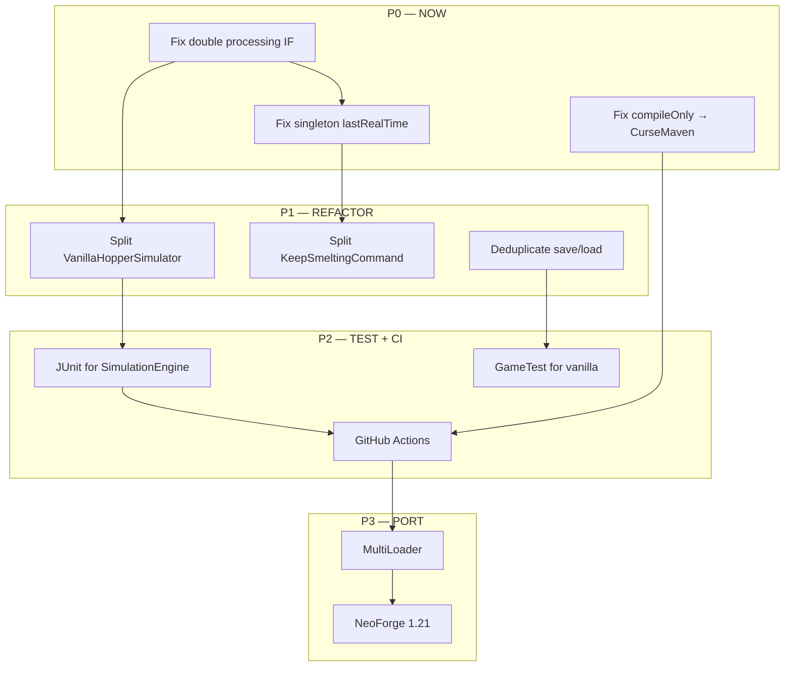

# KeepSmelting Master Refactor Plan (v2 — после аудита)

## ✅ ВАЖНОЕ ОТКРЫТИЕ
`BlockIronFurnaceTileBase extends TileEntityInventory extends BlockEntity` — **НЕ наследует** `AbstractFurnaceBlockEntity`.
Это значит:
- **P0.1 (double processing) — FALSE ALARM.** Ванильная mixin (`@Mixin AbstractFurnace`) и IF mixin (`@Mixin target=BlockIronFurnaceTileBase`) нацелены на разные иерархии классов. Два разных инжекта в два разных тикера. Флаг `catchupProcessed` — мёртвый код.
- **P0.2 (singleton lastRealTime) — FALSE ALARM.** `AbstractCatchupHandler.lastRealTime` нигде не используется для IF — `saveTime/loadTime` никто не вызывает. Время хранится в per-tile mixin-переменных `keepsmelting$lastRealTime`.

## Реальный P0
Настоящая проблема — **compileOnly files() не работает на CI**. CurseMaven фикс.
Рефакторинг — **убрать dead code**, который вводит в заблуждение.


## Цель
Стабилизировать мод, исправить критические баги, навести порядок в архитектуре, добавить CI и тесты.

## Приоритеты

```
P0 — БЛОКЕРЫ (CI, dead code)
P1 — РЕФАКТОРИНГ (улучшение архитектуры, безопасно)
P2 — ТЕСТЫ + CI (предотвращение регрессий)
P3 — ПОРТИРОВАНИЕ (MultiLoader, новые версии)
```

---

## P0 — ВЫПОЛНЕНО (v2)

### 0.1 ~~Двойная обработка~~ → Удалён dead code `catchupProcessed`

**Результат аудита:** FALSE ALARM. `BlockIronFurnaceTileBase` НЕ наследует `AbstractFurnaceBlockEntity`.
Два mixin нацелены на разные иерархии классов, double processing невозможен.

**Что сделано:** Убран флаг `keepsmelting$catchupProcessed` и его проверки из [`FurnaceTickMixin`](../src/main/java/com/keepsmelting/mixin/FurnaceTickMixin.java).

### 0.2 ~~Singleton lastRealTime~~ → IronFurnaceCatchupHandler не наследует AbstractCatchupHandler

**Результат аудита:** FALSE ALARM. `saveTime/loadTime` — мёртвый код (0 вызовов). `lastRealTime` используется только через per-tile mixin-переменные.

**Что сделано:** [`IronFurnaceCatchupHandler`](../src/main/java/com/keepsmelting/internal/ironfurnaces/handler/IronFurnaceCatchupHandler.java) больше не extends `AbstractCatchupHandler`, а implements `IFurnaceCatchupHandler` напрямую. save/load no-op.

### 0.3 compileOnly files() → CurseMaven

**Проблема:** Жёсткая ссылка на локальный jar — не собирается на CI.

**Решение:** [`build.gradle`](../build.gradle):
```gradle
repositories {
    maven { url "https://cursemaven.com" }
}
dependencies {
    compileOnly "curse.maven:iron-furnaces-237664:7888952"
}
```
Project ID: **237664**, File ID: **7888952** (ironfurnaces-1.20.1-4.1.8.jar).

### Дополнительно: CatchupDedup перемещён в общий пакет
`CatchupDedup.java` переехал из `internal.ironfurnaces.util` в `internal.catchup` — теперь доступен для всех хендлеров.

---

## P1 — РЕФАКТОРИНГ АРХИТЕКТУРЫ

### 1.1 Разделить VanillaHopperSimulator (681 строка)

**Сейчас:** [`VanillaHopperSimulator`](../src/main/java/com/keepsmelting/internal/catchup/VanillaHopperSimulator.java:1) — discovery + simulation + application в одном классе.

**Цель:**
```
VanillaHopperSimulator.java
  ├── PipelineDiscoverer.java    — discover() поиск узлов
  ├── PipelineSimulator.java     — simulate() bottleneck calc
  └── PipelineApplicator.java    — apply() распределение
```

### 1.2 Разделить KeepSmeltingCommand (465 строк)

**Сейчас:** [`KeepSmeltingCommand`](../src/main/java/com/keepsmelting/command/KeepSmeltingCommand.java:1) — настройки + debug + test patterns + scan.

**Цель:**
```
command/
  ├── KeepSmeltingCommand.java    — только регистрация + routing
  ├── CatchupSubcommand.java      — /keepsmelting catchup
  ├── ConfigSubcommand.java       — /keepsmelting debug|time|maxTicks|minDelta
  ├── StatusSubcommand.java       — /keepsmelting status
  ├── TestSubcommand.java         — /keepsmelting test (patterns)
  └── ScanSubcommand.java         — /keepsmelting scan
```

### 1.3 Устранить дублирование save/load

**Сейчас:** 3 копии логики:
1. [`FurnaceTickMixin:36-48`](../src/main/java/com/keepsmelting/mixin/FurnaceTickMixin.java:36)
2. [`IronFurnaceTickMixin:28-40`](../src/main/java/com/keepsmelting/mixin/ironfurnaces/IronFurnaceTickMixin.java:28)
3. [`AbstractCatchupHandler:48-62`](../src/main/java/com/keepsmelting/api/catchup/AbstractCatchupHandler.java:48)

**Решение:** Утилитный класс `TimeTrackerUtil.save(tag, lastTime, mode)` / `load(tag)`, единый для всех.

### 1.4 FurnaceMode → вынести из IF-пакета

**Сейчас:** [`FurnaceMode`](../src/main/java/com/keepsmelting/internal/ironfurnaces/handler/FurnaceMode.java:20) — лежит в ironfurnaces/, хотя логика общая (furnace batch).

**Решение:** Перенести в `internal/catchup/FurnaceBatchMode.java` или оставить, но переименовать чтобы не путать с `FurnaceMode` enum.

---

## P2 — ТЕСТЫ + CI

### 2.1 Unit-тесты: SimulationEngine

[`SimulationEngine`](../src/main/java/com/keepsmelting/internal/ironfurnaces/simulate/SimulationEngine.java:9) — pure math, без MC-зависимостей. Идеальный кандидат для JUnit 5.

**Что тестировать:**
- simulateNetwork() — корректный расчёт RF
- simulateGeneratorOnly() — сжигание топлива, заполнение буфера
- simulateFactoryOnly() — плавка с расходом RF
- Edge cases: 0 топлива, 0 предметов, переполнение

### 2.2 Game tests: Vanilla catchup

Использовать `@GameTest` (NeoForge) для:
- Печь без воронок — простая догонялка
- Печь с воронкой сверху — input из контейнера
- Печь с воронкой снизу — output в контейнер
- Полный pipeline: источник → воронка → печь → воронка → приемник

### 2.3 GitHub Actions CI

```yaml
.github/workflows/build.yml:
  - build на push/PR
  - matrix: MC 1.20.1, Java 17
  - ./gradlew build
  - ./gradlew runGameTestServer (если будут GameTest)
```

---

## P3 — ПОРТИРОВАНИЕ (опционально)

### 3.1 MultiLoader (NeoForge + Fabric)

**План:** Использовать Architectury Loom или MultiLoader Template.

**Сложность:** Высокая — `ForgeHooks.getBurnTime()`, `ForgeConfigSpec`, `@Mod` — всё платформо-специфично.

### 3.2 NeoForge 1.21.x

**Проблема:** Iron Furnaces под 1.20.1. Для 1.21 IF не существует → IF-модуль будет `@Pseudo @Mixin(defaultRequire=0)`. Ванильная часть портируется без IF.

---

## Диаграмма зависимостей



---

## Файлы для изменения/создания

### Изменяемые:
| Файл | Что делать |
|------|-----------|
| [`FurnaceTickMixin.java`](../src/main/java/com/keepsmelting/mixin/FurnaceTickMixin.java) | Синхронизировать `catchupProcessed` с IF-mixin |
| [`IronFurnaceTickMixin.java`](../src/main/java/com/keepsmelting/mixin/ironfurnaces/IronFurnaceTickMixin.java) | Проверять `catchupProcessed` из ванильной mixin |
| [`IronFurnaceCatchupHandler.java`](../src/main/java/com/keepsmelting/internal/ironfurnaces/handler/IronFurnaceCatchupHandler.java) | Убрать `lastRealTime` из синглтона |
| [`build.gradle`](../build.gradle) | CurseMaven вместо `files()` |
| [`AbstractCatchupHandler.java`](../src/main/java/com/keepsmelting/api/catchup/AbstractCatchupHandler.java) | Держать `lastRealTime` per-tile |

### Новые:
| Файл | Назначение |
|------|-----------|
| `plans/master-refactor-plan.md` | Этот план |
| `.github/workflows/build.yml` | CI |
| `src/test/java/com/keepsmelting/SimulationEngineTest.java` | Unit-тесты |

---

## Порядок реализации

```
Шаг 1: P0.1 + P0.2 — исправить double processing + singleton
Шаг 2: P0.3 — CurseMaven
Шаг 3: P1.1 — Split VanillaHopperSimulator
Шаг 4: P1.2 — Split KeepSmeltingCommand
Шаг 5: P1.3 — Dedup save/load
Шаг 6: P2.1 — JUnit SimulationEngine
Шаг 7: P2.3 — GitHub Actions
Шаг 8: P2.2 — GameTest (если нужно)
Шаг 9: P3 — MultiLoader (опционально, после стабилизации)
```

Каждый шаг — отдельный PR / коммит. Релиз после Шага 3 (критические баги + CurseMaven).
