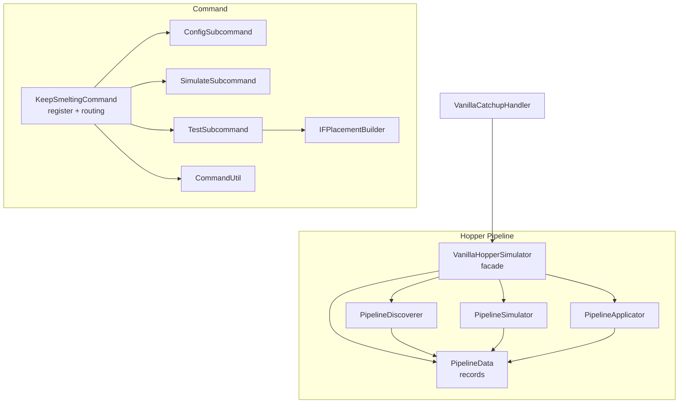

# P1 — Рефакторинг архитектуры

## Структура разбиения

### 1.1 VanillaHopperSimulator (681 строка → 5 классов)

**Текущее состояние:**
```
VanillaHopperSimulator.java (681 строк)
  ├── Data model: PipelineNode, Pipeline, SimulationResult  (~80 строк)
  ├── DISCOVERY: discover()                                  (~120 строк)
  ├── SIMULATION: simulate()                                 (~65 строк)
  ├── APPLY: apply()                                         (~100 строк)
  └── Helpers: fillHoppersFromSources, consumeExternalFuel,  (~316 строк)
              consumeExternalInput, pushOverflowToBelow,
              countSmeltable, countBurnable, countSpace,
              hopperFacing, min, и т.д.
```

**Цель:**
```
internal/catchup/
  ├── VanillaHopperSimulator.java — facade (discover → simulate → apply)
  ├── PipelineData.java           — PipelineNode, Pipeline, SimulationResult records
  ├── PipelineDiscoverer.java     — discover() + count helpers
  ├── PipelineSimulator.java      — simulate() bottleneck calc
  └── PipelineApplicator.java     — apply() + fillHoppersFromSources + consume helpers
```

**Изменяемые файлы:**
| Файл | Действие |
|------|----------|
| `VanillaHopperSimulator.java` | → facade: 3 делегирующих метода |
| `PipelineData.java` (new) | NodeType enum, PipelineNode record, Pipeline record, SimulationResult record |
| `PipelineDiscoverer.java` (new) | discover() + countSmeltable, countBurnable, countSpace, hopperFacing |
| `PipelineSimulator.java` (new) | simulate() |
| `PipelineApplicator.java` (new) | apply() + fillHoppersFromSources, consumeExternalFuel/Input, pushOverflowToBelow |

**Импорты не меняются** — все файлы в том же пакете `com.keepsmelting.internal.catchup`.
`VanillaCatchupHandler` использует только `VanillaHopperSimulator.discover/simulate/apply` → интерфейс не меняется.

### 1.2 KeepSmeltingCommand (465 строк → 6 файлов)

**Текущее состояние:**
```
KeepSmeltingCommand.java (465 строк)
  ├── register() + command tree                (~60 строк)
  ├── SETTINGS: setCatchup, setMaxTicks,       (~60 строк)
  │            setMinDelta, setDebugMode,
  │            setTimeMode, showStatus
  ├── HELP: showHelp                            (~10 строк)
  ├── SIMULATE: runSimulate                     (~25 строк)
  ├── TEST: runTestSpawn, runTest, isIFPattern  (~100 строк)
  ├── PLACEMENT BUILDERS: buildPlacements,      (~60 строк)
  │                     buildIFPlacements
  ├── UTILITY: spawnPlacements, isChestType,    (~80 строк)
  │           fp, getPlayer, getPatternsHelp,
  │           send, sendHelp
  ├── IMPORTS из VanillaTestPatterns             (reference)
```

**Цель:**
```
command/
  ├── KeepSmeltingCommand.java     — register() + command tree routing
  ├── ConfigSubcommand.java        — setCatchup/setMaxTicks/setMinDelta/setDebugMode/setTimeMode + status
  ├── SimulateSubcommand.java      — runSimulate
  ├── TestSubcommand.java          — runTest + runTestSpawn + isIFPattern
  ├── IFPlacementBuilder.java     — buildIFPlacements + IF_PATTERNS + fp(IF)
  └── CommandUtil.java             — send, sendHelp, getPlayer, isChestType, getPatternsHelp
```

**Изменяемые файлы:**
| Файл | Действие |
|------|----------|
| `KeepSmeltingCommand.java` | Оставить только register() + showHelp + общие настройки |
| `ConfigSubcommand.java` (new) | Всё из SETTINGS раздела |
| `SimulateSubcommand.java` (new) | runSimulate |
| `TestSubcommand.java` (new) | runTest, runTestSpawn, isIFPattern, buildPlacements |
| `IFPlacementBuilder.java` (new) | IF_PATTERNS + buildIFPlacements + fp для IF |
| `CommandUtil.java` (new) | send, sendHelp, getPlayer, isChestType, getPatternsHelp |

**Важно:** `spawnPlacements()` использует `ForgeRegistries.BLOCKS` для IF — это остаётся в `TestSubcommand`.

### 1.3 Dedup save/load (P1.3 — опционально, low priority)

**Текущее состояние:** 3 копии:
1. [`FurnaceTickMixin:28-31`](../src/main/java/com/keepsmelting/mixin/FurnaceTickMixin.java:28) — onSave
2. [`FurnaceTickMixin:34-39`](../src/main/java/com/keepsmelting/mixin/FurnaceTickMixin.java:34) — onLoad
3. [`IronFurnaceTickMixin:29-32`](../src/main/java/com/keepsmelting/mixin/ironfurnaces/IronFurnaceTickMixin.java:29) — onSave (дубликат)
4. [`IronFurnaceTickMixin:35-40`](../src/main/java/com/keepsmelting/mixin/ironfurnaces/IronFurnaceTickMixin.java:35) — onLoad (дубликат)

**Проблема:** Нет общей утилиты для сохранения/загрузки `lastRealTime` + `timeMode`.

**Решение:** Утилита:
```java
// internal/time/TimePersistence.java
public class TimePersistence {
    public static void saveLong(CompoundTag tag, String key, long value, String modeKey, Enum<?> mode);
    public static long loadLong(CompoundTag tag, String key, String modeKey, Enum<?> currentMode);
}
```

Но это **низкий приоритет** — дублирование не вызывает багов, просто код не DRY.

---

## Порядок реализации

```
Шаг 1: PipelineData.java — вынести records из VanillaHopperSimulator
Шаг 2: PipelineDiscoverer.java — вынести discover() и счётчики
Шаг 3: PipelineSimulator.java — вынести simulate()
Шаг 4: PipelineApplicator.java — вынести apply() и хелперы
Шаг 5: VanillaHopperSimulator → facade (3 делегирующих метода)
Шаг 6: Сборка, тест
Шаг 7: ConfigSubcommand.java — вынести настройки
Шаг 8: SimulateSubcommand.java — вынести simulate
Шаг 9: TestSubcommand.java + IFPlacementBuilder — вынести test
Шаг 10: CommandUtil.java — вынести утилиты
Шаг 11: KeepSmeltingCommand → register + routing
Шаг 12: Сборка, тест
```

## Диаграмма классов



## Файлы для создания/изменения

### Новые (8 файлов):
| Файл | Строк |
|------|-------|
| `internal/catchup/PipelineData.java` | ~80 |
| `internal/catchup/PipelineDiscoverer.java` | ~130 |
| `internal/catchup/PipelineSimulator.java` | ~70 |
| `internal/catchup/PipelineApplicator.java` | ~200 |
| `command/ConfigSubcommand.java` | ~100 |
| `command/SimulateSubcommand.java` | ~30 |
| `command/TestSubcommand.java` | ~150 |
| `command/CommandUtil.java` | ~60 |

### Изменяемые (2 файла):
| Файл | Было | Стало |
|------|------|-------|
| `VanillaHopperSimulator.java` | 681 строк | ~20 |
| `KeepSmeltingCommand.java` | 465 строк | ~80 |
