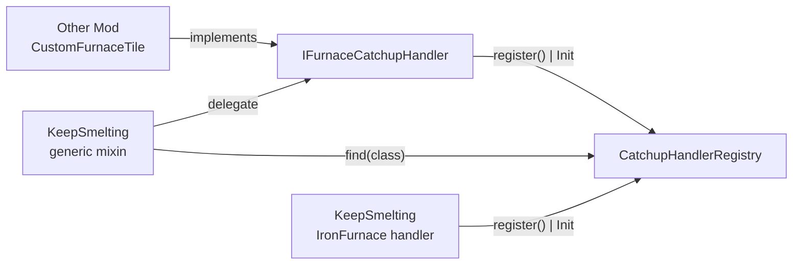
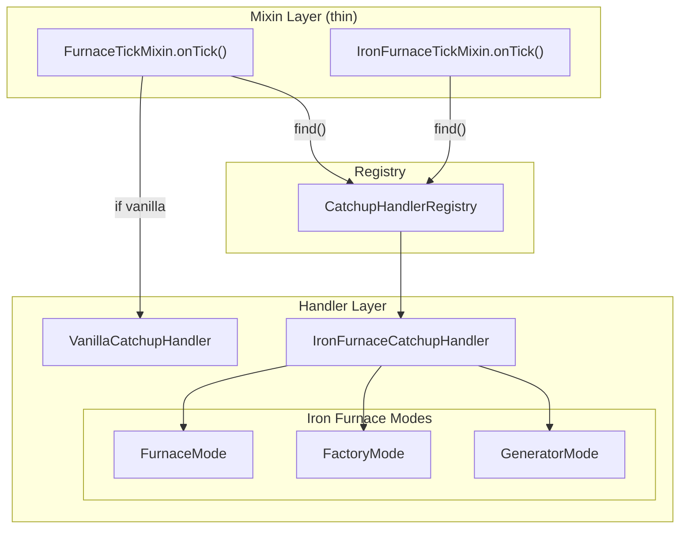

# План рефакторинга KeepSmelting: разделение файлов + API для модов

## 1. Проблемы текущей архитектуры

### 1.1 Миксины-монстры

| Файл | Строк | Что внутри |
|---|---|---|
| `FurnaceTickMixin.java` | **570** | HEAD inject + catchup + hopper IO + fuel calc + cook calc + debug |
| `IronFurnaceTickMixin.java` | **597** | HEAD inject + 3 режима (furnace/factory/generator) + neighbor gen + RF pull + debug |

Миксин не должен содержать бизнес-логику. Его задача — только `@Inject` / `@Redirect` точки входа.

### 1.2 Нет API для других модов

Другие моды с кастомными печками не могут добавить поддержку KeepSmelting, не копируя код или не правя мод напрямую.

### 1.3 Мёртвый код

`util/CookResult.java` (3 строки) — нигде не используется.

---

## 2. Целевая структура

```
src/main/java/com/example/examplemod/
├── KeepSmelting.java                    — @Mod вход, инициализация
├── KeepSmeltingConfig.java              — Конфиг (без изменений)
│
├── api/                                 📦 API для других модов
│   ├── IFurnaceCatchupHandler.java      — Интерфейс: что нужно реализовать
│   ├── CatchupHandlerRegistry.java      — Реестр: регистрация + поиск по классу
│   └── ICatchupTimeTracker.java         — Интерфейс: трекинг времени
│
├── internal/
│   ├── catchup/
│   │   ├── AbstractCatchupHandler.java      — Базовый класс с time tracker
│   │   ├── VanillaCatchupHandler.java       — Vanilla furnace catchup
│   │   └── VanillaHopperIO.java             — Hopper I/O helpers
│   ├── ironfurnaces/
│   │   ├── IronFurnaceCatchupHandler.java   — Точка входа, диспетчер по режимам
│   │   ├── IronFurnaceFurnaceMode.java      — Furnace mode catchup
│   │   ├── IronFurnaceFactoryMode.java      — Factory mode catchup
│   │   ├── IronFurnaceGeneratorMode.java    — Generator mode catchup
│   │   └── IronFurnaceNeighborHelper.java   — Neighbour gen + RF pull
│   ├── registry/
│   │   └── CatchupHandlerRegistry.java     — Реализация реестра
│   └── debug/
│       └── DebugOutput.java                — Дебаг-сообщения (общие для всех)
│
├── command/
│   └── KeepSmeltingCommand.java            — Без изменений
│
├── mixin/                                   🎯 Только точки входа
│   ├── IFurnaceAccessor.java               — Accessor (без изменений)
│   ├── FurnaceTickMixin.java               — ~50 строк: только HEAD inject
│   └── ironfurnaces/
│       ├── IronFurnaceAccessor.java        — Accessor (без изменений)
│       └── IronFurnaceTickMixin.java       — ~60 строк: только HEAD inject
│
└── util/
    └── CookResult.java                     — ❌ УДАЛИТЬ
```

---

## 3. API для других модов



### 3.1 `api/IFurnaceCatchupHandler.java`

```java
public interface IFurnaceCatchupHandler {
    /**
     * @param tile     BlockEntity печки (кастуется модом)
     * @param elapsed  тиков для симуляции
     * @param level    ServerLevel
     * @param pos      позиция печки
     */
    void applyCatchup(BlockEntity tile, long elapsed, Level level, BlockPos pos);
    
    /**
     * Сохранить время в NBT (вызывается из mixin saveAdditional)
     */
    void saveTime(BlockEntity tile, CompoundTag tag);
    
    /**
     * Загрузить время из NBT (вызывается из mixin load)
     */
    void loadTime(BlockEntity tile, CompoundTag tag);
}
```

### 3.2 `api/CatchupHandlerRegistry.java`

```java
public class CatchupHandlerRegistry {
    // Mod author register:
    public static void register(Class<? extends BlockEntity> tileClass, 
                                IFurnaceCatchupHandler handler);
    
    // KeepSmelting internally calls:
    public static IFurnaceCatchupHandler find(Class<?> tileClass); // walks hierarchy
}
```

### 3.3 `api/ICatchupTimeTracker.java`

```java
public interface ICatchupTimeTracker {
    long calcElapsedTicks(Level level, long lastTime, long now);
    void saveToNBT(CompoundTag tag);
    void loadFromNBT(CompoundTag tag);
}
```

### 3.4 Пример использования другим модом

```java
// CustomFurnaceHandler.java — в своём моде
public class CustomFurnaceHandler implements IFurnaceCatchupHandler {
    @Override
    public void applyCatchup(BlockEntity tile, long elapsed, Level level, BlockPos pos) {
        CustomFurnaceTile ft = (CustomFurnaceTile) tile;
        // catchup логика...
    }
}

// В @Mod конструкторе:
CatchupHandlerRegistry.register(CustomFurnaceTile.class, new CustomFurnaceHandler());
```

---

## 4. Внутренняя архитектура KeepSmelting

### 4.1 Mixin → Handler



### 4.2 Поток вызовов для Iron Furnaces

```
IronFurnaceTickMixin.onTick()             ← @Inject(method = "tick", at = @At("HEAD"))
  └─ CatchupHandlerRegistry.find(tile.getClass())
       └─ IronFurnaceCatchupHandler (зарегистрирован в KeepSmelting.java)
            ├─ check mode → IronFurnaceFurnaceMode.apply()
            ├─ check mode → IronFurnaceFactoryMode.apply()
            └─ check mode → IronFurnaceGeneratorMode.apply()
```

### 4.3 Поток вызовов для ванили

```
FurnaceTickMixin.onTick()                 ← @Inject(method = "serverTick", at = @At("HEAD"))
  └─ CatchupHandlerRegistry.find(furnace.getClass())
       ├─ null → VanillaCatchupHandler.applyCatchup()   ← fallback для всех AbstractFurnaceBlockEntity
       └─ не null → кастомный хендлер
```

---

## 5. Детальное разбиение файлов

### 5.1 `internal/catchup/AbstractCatchupHandler.java`

Базовый класс для всех хендлеров. Содержит:
- времянку (keepsmelting$lastRealTime, save/load NBT)
- calcElapsedTicks()
- sendDebug()

```java
public abstract class AbstractCatchupHandler implements IFurnaceCatchupHandler {
    private long lastRealTime;
    private String activeTimeMode;
    
    public long calcElapsedTicks(Level level, long last, long now) { ... }
    public void saveTime(BlockEntity tile, CompoundTag tag) { ... }
    public void loadTime(BlockEntity tile, CompoundTag tag) { ... }
    public boolean shouldSkipTick(Level level) { ... } // client check + enabled config
}
```

### 5.2 `internal/catchup/VanillaCatchupHandler.java`

Переезжает из `FurnaceTickMixin`:
- `applyFurnaceCatchup()` — основная логика ~150 строк
- встраивает `VanillaHopperIO` для IO операций

### 5.3 `internal/catchup/VanillaHopperIO.java`

Переезжает из `FurnaceTickMixin`:
- `fillInputFromAbove()`
- `pullFuelFromSides()`
- `pushToBelow()`
- `isSmeltable()`
- `applyFuelTime()`
- `applyCookTime()`

### 5.4 `internal/ironfurnaces/IronFurnaceCatchupHandler.java`

Точка входа, зарегистрированная в реестре:
```java
public class IronFurnaceCatchupHandler extends AbstractCatchupHandler {
    @Override
    public void applyCatchup(BlockEntity tile, long elapsed, Level level, BlockPos pos) {
        BlockIronFurnaceTileBase ift = (BlockIronFurnaceTileBase) tile;
        if (ift.isFurnace()) {
            IronFurnaceFurnaceMode.apply(ift, elapsed, level, pos);
        } else if (ift.isFactory()) {
            // trigger neighbor gen first
            IronFurnaceNeighborHelper.processNeighborGenerators(...)
            IronFurnaceFactoryMode.apply(ift, elapsed, level, pos);
        } else if (ift.isGenerator()) {
            IronFurnaceGeneratorMode.apply(ift, elapsed, level, pos);
        }
    }
}
```

### 5.5 `internal/ironfurnaces/IronFurnaceFurnaceMode.java`

~100 строк — логика furnace-mode из текущего `applyFurnaceCatchup()`.

### 5.6 `internal/ironfurnaces/IronFurnaceFactoryMode.java`

~120 строк — логика factory-mode.

### 5.7 `internal/ironfurnaces/IronFurnaceGeneratorMode.java`

~80 строк — логика generator-mode.

### 5.8 `internal/ironfurnaces/IronFurnaceNeighborHelper.java`

~50 строк — `processNeighborGenerators()` + `pullAllRFFromNeighborGenerators()`.

### 5.9 `internal/registry/CatchupHandlerRegistry.java`

~40 строк — `ConcurrentHashMap<Class<?>, IFurnaceCatchupHandler>` + `find()` с walk по суперклассам.

### 5.10 `internal/debug/DebugOutput.java`

~60 строк — `sendChatDebug()`, `sendToNearbyPlayers()` — общие для всех режимов.

### 5.11 Миксины (тонкий слой)

**`FurnaceTickMixin.java`** (~50 строк):
```java
@Mixin(AbstractFurnaceBlockEntity.class)
public abstract class FurnaceTickMixin {
    @Unique private long keepsmelting$lastRealTime;
    @Unique private String keepsmelting$activeTimeMode;

    @Inject(method = "saveAdditional", at = @At("TAIL"))
    private void onSave(CompoundTag tag, CallbackInfo ci) { ... }

    @Inject(method = "load", at = @At("TAIL"))
    private void onLoad(CompoundTag tag, CallbackInfo ci) { ... }

    @Inject(method = "serverTick", at = @At("HEAD"))
    private static void onTick(Level world, BlockPos pos, BlockState state,
                                AbstractFurnaceBlockEntity furnace, CallbackInfo ci) {
        if (world.isClientSide) return;
        if (!KeepSmeltingConfig.COMMON.catchupEnabled.get()) return;
        
        FurnaceTickMixin self = (FurnaceTickMixin)(Object) furnace;
        
        // calc elapsed
        long elapsed = ...; // 15 строк calc-логики
        
        IFurnaceCatchupHandler handler = CatchupHandlerRegistry.find(furnace.getClass());
        if (handler != null) {
            handler.applyCatchup(furnace, elapsed, world, pos);
        } else {
            VanillaCatchupHandler.INSTANCE.applyCatchup(furnace, elapsed, world, pos);
        }
    }
}
```

**`IronFurnaceTickMixin.java`** (~60 строк) — аналогично, но вызывает `IronFurnaceCatchupHandler`.

---

## 6. Регистрация хендлеров в KeepSmelting.java

```java
@Mod(KeepSmelting.MOD_ID)
public class KeepSmelting {
    public KeepSmelting() {
        KeepSmeltingConfig.register();

        // Регистрация встроенных хендлеров
        CatchupHandlerRegistry.register(
            BlockIronFurnaceTileBase.class,
            new IronFurnaceCatchupHandler()
        );

        // ... остальная инициализация
    }
}
```

---

## 7. Итог: что изменится

| Файл | Было | Стало |
|---|---|---|
| `FurnaceTickMixin.java` | 570 строк (всё) | ~50 строк (только inject) |
| `IronFurnaceTickMixin.java` | 597 строк (всё) | ~60 строк (только inject) |
| `CookResult.java` | 3 строки (unused) | ❌ удалён |
| `KeepSmelting.java` | 37 строк | ~45 строк (добавлена регистрация) |
| **Новые файлы** | — | **10 новых файлов** |

```
NEW FILES:
api/
├── IFurnaceCatchupHandler.java
├── ICatchupTimeTracker.java
└── CatchupHandlerRegistry.java       (duck: api + internal impl)

internal/catchup/
├── AbstractCatchupHandler.java
├── VanillaCatchupHandler.java
└── VanillaHopperIO.java

internal/ironfurnaces/
├── IronFurnaceCatchupHandler.java
├── IronFurnaceFurnaceMode.java
├── IronFurnaceFactoryMode.java
├── IronFurnaceGeneratorMode.java
└── IronFurnaceNeighborHelper.java

internal/debug/
└── DebugOutput.java
```

---

## 8. Миграционный план

1. Создать структуру папок `api/`, `internal/catchup/`, `internal/ironfurnaces/`, `internal/debug/`
2. Создать все новые файлы (сначала пустые классы)
3. Скопировать логику из миксинов в хендлеры
4. Уменьшить миксины до тонкого слоя
5. Удалить `CookResult.java`
6. Собрать, протестировать
7. Написать документацию для других модов
