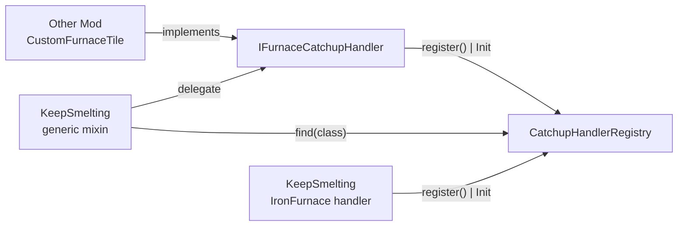
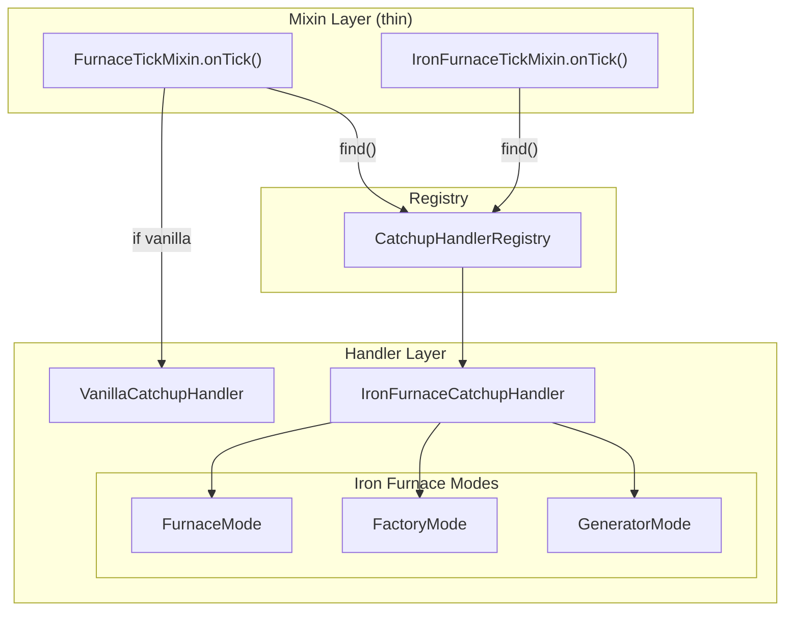

# План рефакторинга KeepSmelting: разделение файлов + API для модов

## 1. Проблемы текущей архитектуры

### 1.1 Миксины-монстры

| Файл | Строк | Что внутри |
|---|---|---|
| `FurnaceTickMixin.java` | **570** | HEAD inject + catchup + hopper IO + fuel calc + cook calc + debug |
| `IronFurnaceTickMixin.java` | **597** | HEAD inject + 3 режима (furnace/factory/generator) + neighbor gen + RF pull + debug |

Миксин не должен содержать бизнес-логику. Его задача — только `@Inject` / `@Redirect` точки входа.

### 1.2 Нет API для других модов

Другие моды с кастомными печками не могут добавить поддержку KeepSmelting, не копируя код или не правя мод напрямую.

### 1.3 Мёртвый код

`util/CookResult.java` (3 строки) — нигде не используется.

### 1.4 `com.example.examplemod` — стандартный MDK package

Может конфликтовать с другими модами. Нужно сменить на уникальный.

### 1.5 Только COMMON конфиг — это нормально

Мод сервер-сайд (catchup выполняется на ServerLevel). CLIENT конфиг избыточен. `debugMode` — решение админа, не пер-плеер. Если мод помечен `side="SERVER"` в mods.toml — Forge автоматически не загружает COMMON конфиг на клиенте.

### 1.6 `accesstransformer.cfg`

Всего 1 строка — судя по коду миксинов нигде не используется.

---

## 2. Целевая структура

```
src/main/java/com/example/examplemod/          ← позже переименовать в com.keepsmelting
├── KeepSmelting.java                    — @Mod вход, инициализация
├── KeepSmeltingConfig.java              — Конфиг (COMMON + CLIENT)
│
├── api/                                 📦 API для других модов
│   ├── IFurnaceCatchupHandler.java      — Интерфейс: что нужно реализовать
│   ├── CatchupHandlerRegistry.java      — Реестр: регистрация + поиск по классу
│   └── ICatchupTimeTracker.java         — Интерфейс: трекинг времени
│
├── internal/
│   ├── catchup/
│   │   ├── AbstractCatchupHandler.java      — Базовый класс с time tracker
│   │   ├── VanillaCatchupHandler.java       — Vanilla furnace catchup
│   │   └── VanillaHopperIO.java             — Hopper I/O helpers
│   ├── ironfurnaces/
│   │   ├── IronFurnaceCatchupHandler.java   — Точка входа, диспетчер по режимам
│   │   ├── IronFurnaceFurnaceMode.java      — Furnace mode catchup
│   │   ├── IronFurnaceFactoryMode.java      — Factory mode catchup
│   │   ├── IronFurnaceGeneratorMode.java    — Generator mode catchup
│   │   └── IronFurnaceNeighborHelper.java   — Neighbour gen + RF pull
│   ├── registry/
│   │   └── CatchupHandlerRegistry.java     — Реализация реестра
│   └── debug/
│       └── DebugOutput.java                — Дебаг-сообщения (общие для всех)
│
├── command/
│   └── KeepSmeltingCommand.java            — Без изменений
│
├── mixin/                                   🎯 Только точки входа
│   ├── IFurnaceAccessor.java               — Accessor (без изменений)
│   ├── FurnaceTickMixin.java               — ~50 строк: только HEAD inject
│   └── ironfurnaces/
│       ├── IronFurnaceAccessor.java        — Accessor (без изменений)
│       └── IronFurnaceTickMixin.java       — ~60 строк: только HEAD inject
│
└── util/                                    ❌ УДАЛИТЬ
    └── CookResult.java                     — unused
```

---

## 3. API для других модов



### 3.1 `api/IFurnaceCatchupHandler.java`

```java
public interface IFurnaceCatchupHandler {
    void applyCatchup(BlockEntity tile, long elapsed, Level level, BlockPos pos);
    void saveTime(BlockEntity tile, CompoundTag tag);
    void loadTime(BlockEntity tile, CompoundTag tag);
}
```

### 3.2 `api/CatchupHandlerRegistry.java`

```java
public class CatchupHandlerRegistry {
    public static void register(Class<? extends BlockEntity> tileClass, IFurnaceCatchupHandler handler);
    public static IFurnaceCatchupHandler find(Class<?> tileClass); // walks hierarchy
}
```

### 3.3 `api/ICatchupTimeTracker.java`

```java
public interface ICatchupTimeTracker {
    long calcElapsedTicks(Level level, long lastTime, long now);
    void saveToNBT(CompoundTag tag);
    void loadFromNBT(CompoundTag tag);
}
```

### 3.4 Пример использования другим модом

```java
public class CustomFurnaceHandler implements IFurnaceCatchupHandler {
    @Override
    public void applyCatchup(BlockEntity tile, long elapsed, Level level, BlockPos pos) {
        CustomFurnaceTile ft = (CustomFurnaceTile) tile;
        // catchup логика...
    }
}

// В @Mod конструкторе другого мода:
CatchupHandlerRegistry.register(CustomFurnaceTile.class, new CustomFurnaceHandler());
```

---

## 4. Внутренняя архитектура KeepSmelting

### 4.1 Mixin → Handler



### 4.2 Поток вызовов для Iron Furnaces

```
IronFurnaceTickMixin.onTick()
  -> CatchupHandlerRegistry.find(tile.getClass())
    -> IronFurnaceCatchupHandler
      -> FurnaceMode / FactoryMode / GeneratorMode
```

### 4.3 Поток вызовов для ванили

```
FurnaceTickMixin.onTick()
  -> CatchupHandlerRegistry.find(furnace.getClass())
    -> null -> VanillaCatchupHandler.applyCatchup()
    -> not null -> custom handler
```

---

## 5. Детальное разбиение файлов

### 5.1 `internal/catchup/AbstractCatchupHandler.java`

Базовый класс для всех хендлеров. Содержит:
- времянку (keepsmelting$lastRealTime, save/load NBT)
- calcElapsedTicks()
- sendDebug()

```java
public abstract class AbstractCatchupHandler implements IFurnaceCatchupHandler {
    private long lastRealTime;
    private String activeTimeMode;
    
    public long calcElapsedTicks(Level level, long last, long now) { ... }
    public void saveTime(BlockEntity tile, CompoundTag tag) { ... }
    public void loadTime(BlockEntity tile, CompoundTag tag) { ... }
    public boolean shouldSkipTick(Level level) { ... }
}
```

### 5.2 `internal/catchup/VanillaCatchupHandler.java`

Переезжает из FurnaceTickMixin:
- applyFurnaceCatchup() ~150 строк
- встраивает VanillaHopperIO

### 5.3 `internal/catchup/VanillaHopperIO.java`

Переезжает из FurnaceTickMixin:
- fillInputFromAbove()
- pullFuelFromSides()
- pushToBelow()
- isSmeltable()
- applyFuelTime()
- applyCookTime()

### 5.4 `internal/ironfurnaces/IronFurnaceCatchupHandler.java`

Точка входа, зарегистрированная в реестре. 3 режима.

### 5.5 `internal/ironfurnaces/IronFurnaceFurnaceMode.java`

~100 строк — furnace-mode логика.

### 5.6 `internal/ironfurnaces/IronFurnaceFactoryMode.java`

~120 строк — factory-mode логика.

### 5.7 `internal/ironfurnaces/IronFurnaceGeneratorMode.java`

~80 строк — generator-mode логика.

### 5.8 `internal/ironfurnaces/IronFurnaceNeighborHelper.java`

~50 строк — processNeighborGenerators() + pullAllRFFromNeighborGenerators().

### 5.9 `internal/registry/CatchupHandlerRegistry.java`

~40 строк — ConcurrentHashMap + find() с walk по суперклассам.

### 5.10 `internal/debug/DebugOutput.java`

~60 строк — sendChatDebug(), sendToNearbyPlayers() — общие для всех режимов.

### 5.11 Миксины (тонкий слой)

После рефакторинга каждый миксин ~50-60 строк:
- NBT save/load
- calc elapsed ticks
- registry lookup + delegate

---

## 6. Регистрация хендлеров в KeepSmelting.java

```java
@Mod(KeepSmelting.MOD_ID)
public class KeepSmelting {
    public KeepSmelting() {
        KeepSmeltingConfig.register();
        CatchupHandlerRegistry.register(
            BlockIronFurnaceTileBase.class,
            new IronFurnaceCatchupHandler()
        );
        // ...
    }
}
```

---

## 7. Итог: что изменится

| Файл | Было | Стало |
|---|---|---|
| FurnaceTickMixin.java | 570 строк | ~50 строк |
| IronFurnaceTickMixin.java | 597 строк | ~60 строк |
| CookResult.java | 3 строки (unused) | УДАЛЁН |
| KeepSmelting.java | 37 строк | ~45 строк (+регистрация) |
| **Новые файлы** | — | **10 новых файлов** |

---

## 8. Миграционный план

1. Создать структуру папок api/, internal/catchup/, internal/ironfurnaces/, internal/debug/
2. Создать все новые файлы (сначала пустые классы)
3. Скопировать логику из миксинов в хендлеры
4. Уменьшить миксины до тонкого слоя
5. Удалить CookResult.java
6. Собрать, протестировать
7. Написать документацию для других модов

---

## 9. Дополнительные проблемы в текущей кодовой базе

### 9.1 com.example.examplemod — временный package name

```
mod_group_id=com.example.examplemod
```

Это стандартный шаблон Forge MDK. Нужно заменить на осмысленный, например com.keepsmelting или io.github.keepsmelting. Менять надо в:
- gradle.properties
- всех package декларациях
- keepsmelting.mixins.json

### 9.2 Нет CLIENT/SERVER конфигов

Только COMMON. Forge позволяет 3 типа. debugMode можно в CLIENT.

### 9.3 accesstransformer.cfg

Всего 1 строка, нигде не используется. Возможно мёртвый код.

### 9.4 gradle.properties — метаданные

- mod_license=All Rights Reserved — лучше open-source
- mod_version=1.0.0 — норм, SemVer
- mod_authors=KeepSmelting — заменить на реального автора

### 9.5 Нет CI/CD

Нет GitHub Actions, нет автосборки.

### 9.6 Кэширование конфига

org.gradle.configuration-cache=true может ломаться при смене MC версий.

---

## 10. Стратегия портирования на разные версии MC и загрузчики

### 10.1 Почему это сложно

Текущая архитектура жёстко привязана к Forge:
- Mixin plugin system (Forge-версия)
- @Mixin(AbstractFurnaceBlockEntity.class) — меняется между версиями
- @Mod, FMLJavaModLoadingContext — Forge-specific
- ForgeConfigSpec — Forge-specific
- ForgeHooks.getBurnTime() — меняется сигнатура
- BlockIronFurnaceTileBase — только 1.20.1 Forge

### 10.2 Рекомендуемая архитектура: Common + Platform

```
keepsmelting/
  common/                  ← чистый Java, без MC-зависимостей
    api/IFurnaceCatchupHandler.java
    internal/catchup/
      VanillaCatchupHandler.java
      VanillaHopperIO.java
  forge/                   ← Forge + NeoForge
    KeepSmelting.java (@Mod)
    KeepSmeltingConfig.java (ForgeConfigSpec)
    mixin/
  fabric/                  ← Fabric + Quilt
    KeepSmelting.java (ModInitializer)
    KeepSmeltingConfig.java (YACL / custom)
    mixin/
```

Весь Minecraft-специфичный код — только в платформенных модулях.

### 10.3 Варианты реализации

| Метод | Сложность | Поддержка версий | Поддержка загрузчиков |
|---|---|---|---|
| 1. Ручные бранчи | Низкая | Cherry-pick ад | Любой |
| 2. MultiLoader Template | Средняя | Новая ветка на версию | Forge+Fabric+Neo |
| 3. Architectury Loom | Средняя | Обновлять маппинги | Forge+Fabric |
| 4. Common как библиотека (jar) | Высокая | Подключается к любой | Любой |

**Рекомендация:** начать с MultiLoader Template (вариант 2).

### 10.4 Что меняется между версиями MC

| Класс/метод | 1.20.1 | 1.21+ |
|---|---|---|
| AbstractFurnaceBlockEntity | Тот же класс | Тот же (пока) |
| ForgeHooks.getBurnTime() | Статический | Через AbstractFurnaceBlockEntity |
| RecipeType.SMELTING | SRG f_44108_ | Уже деобфусцирован |
| ItemStack save/load | CompoundTag | DataComponent в 1.21.5+ |
| System.currentTimeMillis() | Java SE | Не меняется |

### 10.5 Iron Furnaces — проблема портирования

Iron Furnaces существует только для Forge 1.20.1. На Fabric/Neo — отсутствует. ironfurnaces/ миксины просто исключаются из сборки (defaultRequire: 0).

### 10.6 CI/CD для мульти-загрузчика

```yaml
strategy:
  matrix:
    loader: [forge, fabric, neoforge]
    mc_version: [1.20.1, 1.21, 1.21.1]
steps:
  - run: ./gradlew :${{ matrix.loader }}:build
```

---

## 11. Итоговый список задач

### Фаза 1: Быстрые фиксы (1-2 дня)
- [x] Переименовать com.example.examplemod -> com.keepsmelting
- [x] Сменить лицензию MIT + автор M4CK4L3N
- [x] Удалить CookResult.java
- [x] Удалить accesstransformer.cfg
- [x] Обновить gradle.properties

### Фаза 0: Оптимизация Iron Furnaces catchup (сейчас)
- [ ] Factory Mode: переписать на адаптивный batch (O(elapsed×6) → O(events))
- [ ] Generator Mode: переписать на batch (низкий приоритет)

### Фаза 2: Рефакторинг архитектуры (3-5 дней)
- [ ] Создать api/ и internal/ структуру
- [ ] Вынести логику из FurnaceTickMixin в VanillaCatchupHandler
- [ ] Вынести логику из IronFurnaceTickMixin в режимные хендлеры
- [ ] Уменьшить миксины до ~50 строк
- [ ] Собрать, протестировать

### Фаза 3: API для модов (2-3 дня)
- [ ] Реализовать IFurnaceCatchupHandler
- [ ] Реализовать CatchupHandlerRegistry
- [ ] Сделать документацию / README
- [ ] Опубликовать API jar

### Фаза 4: Мульти-загрузчик (1-2 недели)
- [ ] Перейти на MultiLoader Template
- [ ] Выделить common-модуль
- [ ] Сделать Forge-платформу
- [ ] Сделать Fabric-платформу
- [ ] Настроить CI/CD
- [ ] Опубликовать на Modrinth + CurseForge
